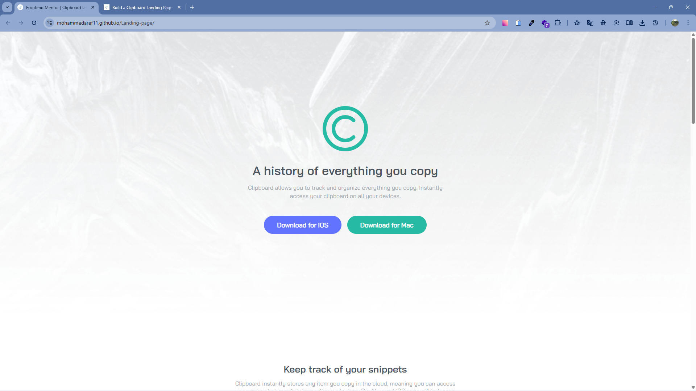
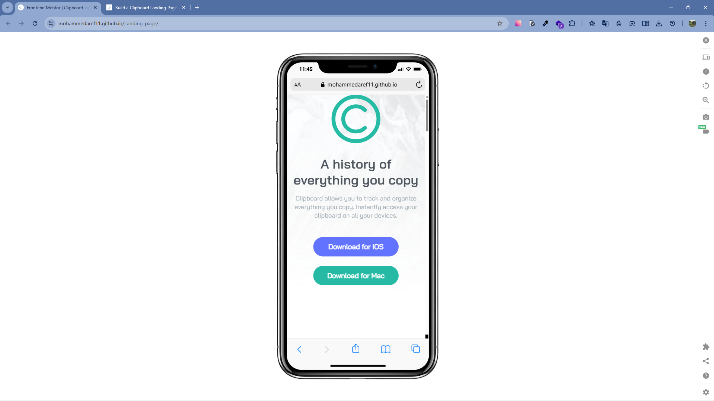

# Landing page challenge Frontend

I Managed to finish this page in couple hours i faced some challenges with some sections images but i leared alot about relative unites and that it is important to use them like %.

here is the link to my website [Click here](https://mohammedaref11.github.io/Landing-page/)

you can try and do the challenge your self [Click Here](https://www.frontendmentor.io/challenges/clipboard-landing-page-5cc9bccd6c4c91111378ecb9)

## Desktop

## Mobile
